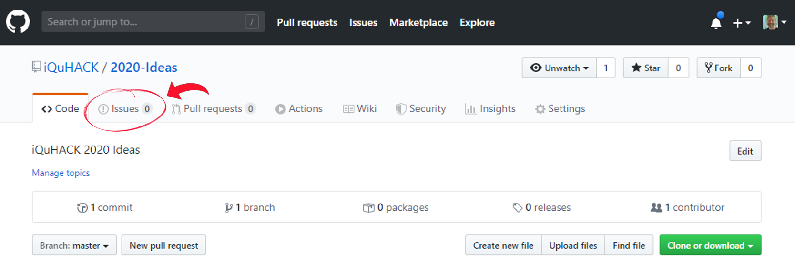
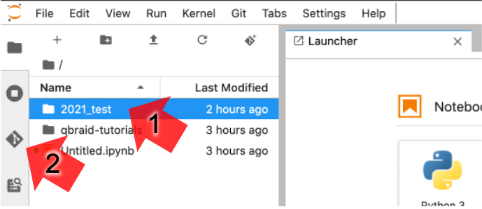
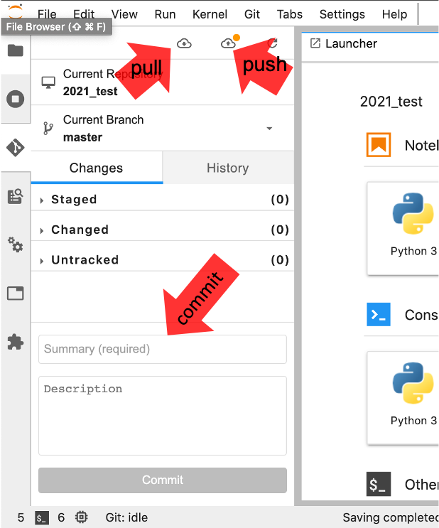

# 2021
## Submit a new idea by opening a [new issue](https://github.com/iQuHACK/2021/issues/new "go to New Issue")

[](https://github.com/iQuHACK/2021/issues "go to Issues")

Keep in mind these ideas are open to the public and not regulated.

## Projects GitHub Instructions
All teams will have a git repository at `https://github.com/iQuHACK/2021_<team_name>`.

### Do NOT commit private credentials or API keys
Stick them in an environment file and add that file to your git ignore.
If you need help with this, please reach out to us.

If you do accidentally push a commit with any sensitive information let us know ASAP so we can help fix the situation.
It is not enough to simply remove the file in another commit.

### Repositories will become public at the end of the hackathon

### Workflow (remote development)
This is slightly easier if you don't want to spend any time installing packages locally.

</img>
**[qBraid](https://www.qbraid.com/)** has generously prepared a virtual environment with the above packages and dependencies installed as well as some tutorial jupyter notebooks.
After you [create an account](https://account.qbraid.com/join), select the iQuHACK package and you’re ready to go!

1. Complete and submit the [team formation form](https://forms.gle/yhBwRT78Vtt1S5nL8).
1. You will get an invitation to become a collaborator on your team's repository.
1. Make an account at https://account.qbraid.com/join 
2. We are using learn.qbraid.com for iQuHACK. No need for an access key.
3. Launch the iQuHACK environment (top right).

To setup the repo:

1. In your home directory, select the "Clone Repo" icon (make sure you haven't navigated into "qbraid-tutorials", and if you have just navigate back to your home directory).

    </img>

2. Grab the clone URL from github and paste it in. Make sure to use https unless you are planning to customize to use ssh keys.

3. Navigate into your newly cloned repository folder, then select the "Git" tab on the right.

    </img>

4. First commit, you will need to enter your standard git config options if you haven't already.
5. `push`/`pull` are available from the git tab with arrows above your nav panel. If you have set it up to use https, you will have to enter your user/password each time.

    </img>

Note, this is your own unix user account and if you prefer a different setup (e.g. using ssh keys to avoid having to enter your password each time), feel free to set it up that way! Let us know if you'd like help or you get stuck.

For questions/issues specifically about qBraid, you can contact them through email or slack.
- contact@qbraid.com
- `#qbraid` channel in our [event's slack](https://iquhack.slack.com)

### Workflow (local development)
1. Complete and submit the [team formation form](https://forms.gle/yhBwRT78Vtt1S5nL8).
2. You will get an invite to your repo. Clone your repository.
3. Begin hacking!
4. Before the submission deadline, make sure you push/merge your final work to the `main` branch. You will lose push permission right at the deadline.

### Team Names
You can change your team's name at any point by contacting one of the staff through Slack or email iquhack@mit.edu.
We will update your repo's name accordingly with the most recent submission.

### After the event
After submission closes, we will remove your team's access to that repo and make it public.
**Feel free to fork it and keep working on it after the event!**

## Resources
### Getting Started
We recommend using conda for your project. If you aren't familiar with it, once setup you barely have to interact with it! Checkout their installation instructions [here](https://docs.conda.io/projects/conda/en/latest/user-guide/install/).

We have seen some issues using python 3.8, so we recommend using **Python 3.7**.
For example, if you want your environment named `iQuHACK`:
```
conda create -n iQuHACK python=3.7
pip install qiskit
```
To load this environment: `conda activate iQuHACK`.

If `conda` cannot be found (and you are on a unix-like system), you most likely have *not* initialized it during installing.
You can do this by running the init script in the installation directory:
```
source <path to conda>/bin/activate
conda init zsh
```
Then you should be good to go. MacOS Catalina now uses `zsh` shell instead of `bash`, but put your appropriate shell name there.

#### iQuHACK
- [iquhack.slack.com](https://iquhack.slack.com/) (check your email for invite link, or email iquhack@mit.edu)
- [iQuHACK site](https://www.iquise.mit.edu/iQuHACK)

#### Resources

All of these can be found in jupyter notebooks **already setup and ready to run** in your qbraid account!
If you haven't yet, make an account ([see above](#workflow-remote-development)).

- [D-Wave Tutorials](https://www.dwavesys.com/resources/tutorials) (`qbraid-tutorials/Tutorials/[COMING SOON]`)
- [ionQ Technology](https://ionq.com/technology)
- [Qiskit Tutorials](https://qiskit.org/learn/) (`qbraid-tutorials/Tutorials/ibm_tutorials/`)
- [Qiskit Examples](https://qiskit.org/experiments/)
- [Cirq Tutorials](https://quantumai.google/cirq) (`qbraid-tutorials/Tutorials/google_tutorials/`)
- [Bracket](https://docs.aws.amazon.com/braket/index.html) (`qbraid-tutorials/Tutorials/aws_tutorials/`)
